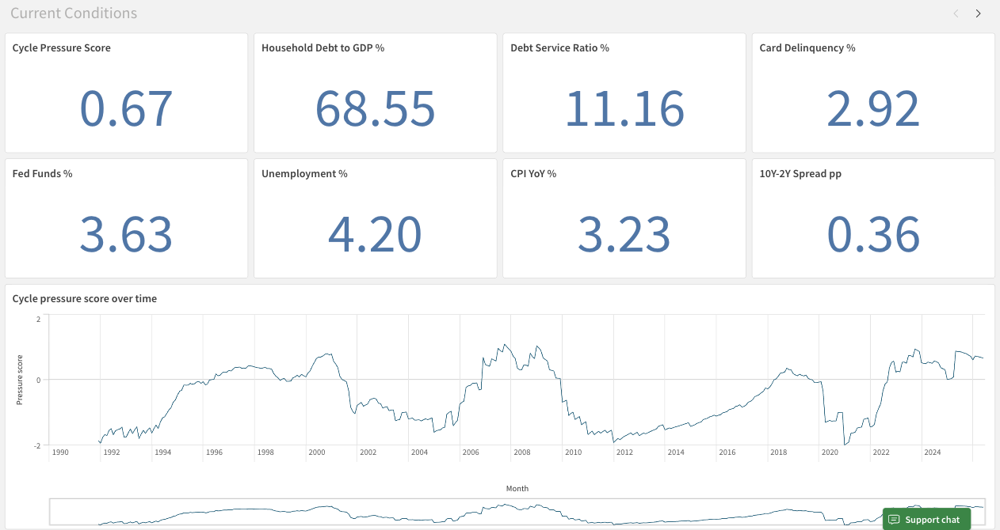
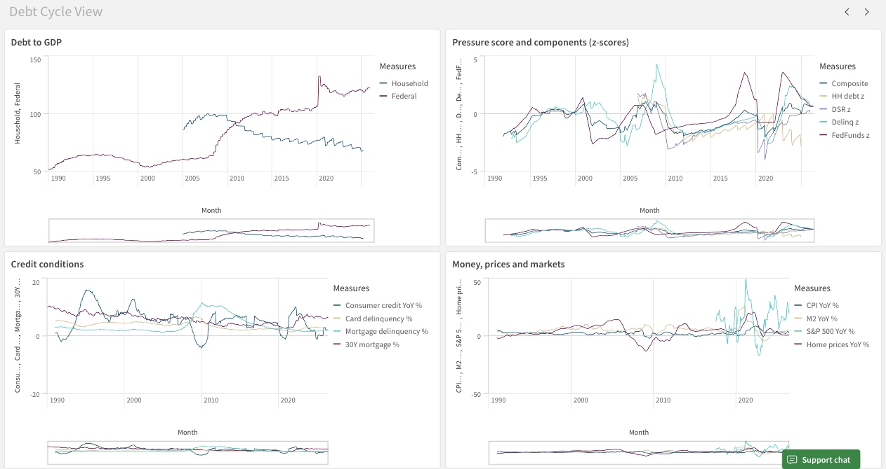
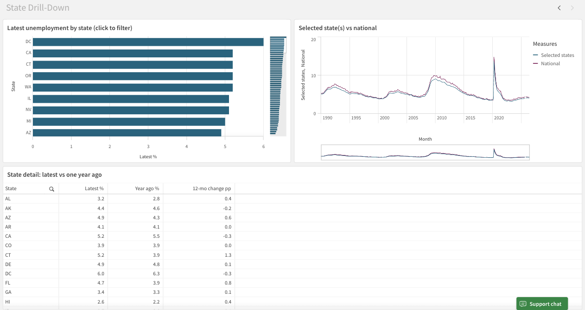
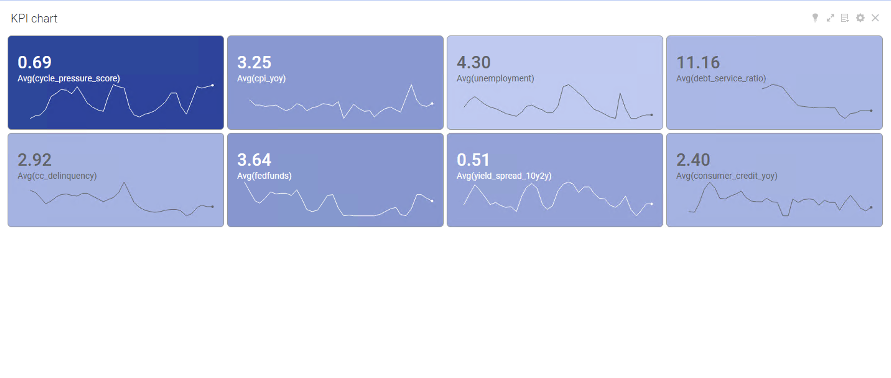
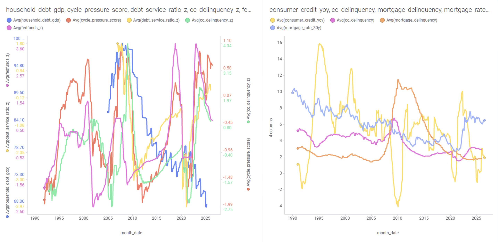
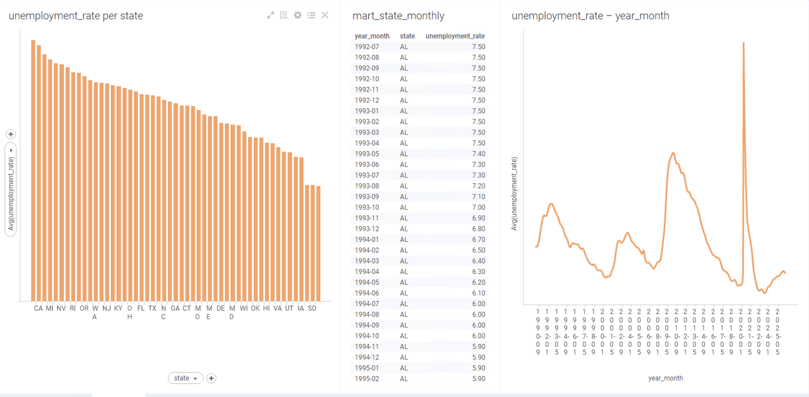

# Debt Cycle BI Tracker

The Debt Cycle BI Tracker is a monthly data pipeline and dashboard project for monitoring federal debt, household credit conditions, interest rates, inflation, and labor market indicators in one place.

The project uses Ray Dalio's debt-cycle framework to group indicators into deflationary, inflationary, or mixed-cycle categories. This makes it easier to compare related economic signals and evaluate whether financial pressure is increasing or easing.

Python retrieves 70 economic series from the Federal Reserve's FRED API. The pipeline validates the data, loads it into a PostgreSQL star schema, and calculates year-over-year changes, rolling 10-year z-scores, yield-curve inversion flags, and a composite pressure score.

The same three-page dashboard was built in Qlik Sense and TIBCO Spotfire using identical data and reporting requirements. This allowed the platforms to be compared based on implementation, visualization, automation, and usability. An optional Amazon Bedrock step generates a one-page monthly summary of the latest changes.

## Current reading

The latest complete pipeline run uses data available through June and July 2026. Some quarterly indicators are released later than the monthly series, so their latest observations are from January.

| Indicator                    |       Latest | Interpretation                                         |
| ---------------------------- | -----------: | ------------------------------------------------------ |
| Composite pressure score     |         0.67 | Overall stress is moderately above its 10-year average |
| Federal debt to GDP          | 122.6% (Jan) | High and continuing to rise                            |
| Household debt service ratio |  11.2% (Jan) | Close to its long-run average                          |
| Credit card delinquency      |   2.9% (Jan) | Above normal and well above its 2021 low               |
| Federal funds rate           |        3.63% | Falling from the 2023 peak                             |
| 10-year minus 2-year spread  |     +0.36 pp | Positive again after an extended inversion             |
| CPI, year over year          |  3.23% (Jul) | Still above the Federal Reserve's target               |
| Unemployment rate            |         4.2% | Low nationally, with a wide range across states        |

The latest reading shows greater household stress through rising credit card delinquencies, while interest rates and the yield curve have been moving toward more typical levels. Federal debt continues to rise regardless of the shorter-term changes in the economic cycle.

## Architecture

```text
FRED API
19 national series + 51 state unemployment series
        |
        v
etl/extract.py
Downloads raw JSON to data/raw/fred/
        |
        v
etl/validate.py
Runs schema, duplicate, continuity, range, and staleness checks
        |
        v
etl/transform.py
Builds the star schema and calculates derived indicators
        |
        v
etl/load.py
Loads PostgreSQL and runs reconciliation checks
        |
        +--> Qlik Sense
        |
        +--> TIBCO Spotfire
        |
        v
etl/brief.py
Generates an optional monthly summary with Claude on Amazon Bedrock
        |
        v
GitHub Actions
Runs the pipeline monthly and commits refreshed reports
```

## Documentation

| Document | Description |
| --- | --- |
| [Requirements](docs/requirements.md) | Project scope, the questions each page answers, and exclusions |
| [Tech stack](docs/tech-stack.md) | Technologies used and the reasoning behind each choice |
| [Dashboard specification](docs/dashboard-spec.md) | Shared requirements for the Qlik and Spotfire versions |
| [Platform comparison](docs/comparison.md) | Comparison of the two BI tools after building the dashboards |
| [Build notes](docs/build-notes.md) | What I did in what order and what broke |

## Quickstart

### 1. Configure the environment

```bash
cp .env.example .env
```

Add your FRED API key and PostgreSQL credentials to `.env`.

### 2. Start PostgreSQL

```bash
docker compose up -d
```

### 3. Install the dependencies

```bash
pip install -r requirements.txt
```

### 4. Run the pipeline

```bash
python -m etl.run_pipeline
```

Tests for the validation gate:

```bash
pip install -r requirements-dev.txt
pytest
```

The pipeline stops when a critical validation check fails. It always writes a validation report to:

```text
reports/validation_report.md
```

The Bedrock summary is optional. The pipeline skips it when AWS credentials are unavailable, or it can be disabled manually:

```bash
python -m etl.run_pipeline --skip-brief
```

### 5. Connect a dashboard

Dashboard-ready extracts are written to:

```text
data/exports/
```

The Qlik Sense and Spotfire dashboards follow the shared requirements in [`docs/dashboard-spec.md`](docs/dashboard-spec.md).

## Data validation

Validation runs before data is loaded into PostgreSQL.

Checks include:

* Required fields and parseable dates
* Numeric observation values
* Duplicate dates within a series
* Missing periods in monthly series
* Plausible ranges for each indicator category
* Stale series based on expected release schedules
* Warehouse row-count reconciliation
* Orphaned foreign keys after loading

Validation results are classified as:

* **Critical:** Stops the pipeline
* **Warning:** Appears in the report but allows the pipeline to continue

## Warehouse design

| Table                     | Grain                                                                |
| ------------------------- | -------------------------------------------------------------------- |
| `fact_observations`       | One row per series and observation date                              |
| `mart_debt_cycle_monthly` | One row per month containing national indicators and derived metrics |
| `mart_state_monthly`      | One row per state and month                                          |
| `dim_series`              | Metadata for each FRED series                                        |
| `dim_date`                | Shared date dimension                                                |

Derived metrics are calculated before the data reaches either dashboard. This keeps the Qlik and Spotfire versions consistent instead of recreating the same calculations separately in each platform.

Each record in `dim_series` also has a `cycle_lens` value:

```text
deflationary
inflationary
both
```

This allows dashboard users to filter indicators based on the type of debt-cycle pressure each series is intended to measure.

## Derived indicators

The transformation layer calculates the metrics used by both dashboards.

These include:

* Year-over-year percentage changes
* Rolling 10-year averages
* Rolling 10-year standard deviations
* Rolling z-scores
* Yield-curve inversion flags
* Credit stress measures
* A composite cycle pressure score

The composite score combines standardized readings from selected debt, credit, interest-rate, inflation, and labor-market indicators.

Calculating these metrics once in the data pipeline ensures that both BI tools display the same results.

## Monthly summary

`etl/brief.py` sends the latest 13 months of national indicators and state-level extremes to Claude through Amazon Bedrock.

The generated summary contains four sections:

* What Changed
* Cycle Position
* Regional Notes
* What to Watch

The summary is saved to:

```text
reports/briefs/YYYY-MM.md
```

This provides a written explanation of the latest movements instead of leaving the conclusions only inside dashboard charts.

## Scheduled refresh

The workflow in:

```text
.github/workflows/monthly-refresh.yml
```

runs on the fifth day of each month.

It starts a PostgreSQL container, runs the pipeline, and commits the updated validation report and monthly summary.

Required GitHub secret:

```text
FRED_API_KEY
```

Optional secrets for the Bedrock summary:

```text
AWS_ACCESS_KEY_ID
AWS_SECRET_ACCESS_KEY
AWS_REGION
```

## Dashboards

Both dashboards use the same three-page specification:

1. Current Conditions
2. Debt Cycle View
3. State Unemployment Drill-Down

### Qlik Sense







### TIBCO Spotfire







## Qlik Sense vs. TIBCO Spotfire

The full comparison is available in [`docs/comparison.md`](docs/comparison.md).

The main findings were:

* **Qlik Sense** was better suited to controlled and repeatable dashboard development. Its Engine and REST APIs also made more of the application build process reproducible.
* **TIBCO Spotfire** was stronger for exploratory analysis. Its individual scale options made it easier to compare several indicators with very different ranges on the same chart.

Neither platform was stronger in every area. Building the same dashboard in both made it possible to compare their actual implementation and analysis workflows instead of relying only on published feature lists.
