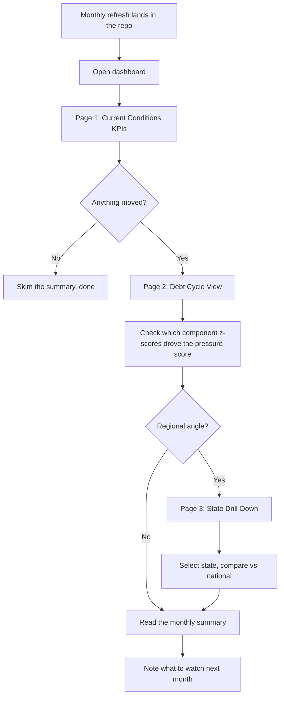
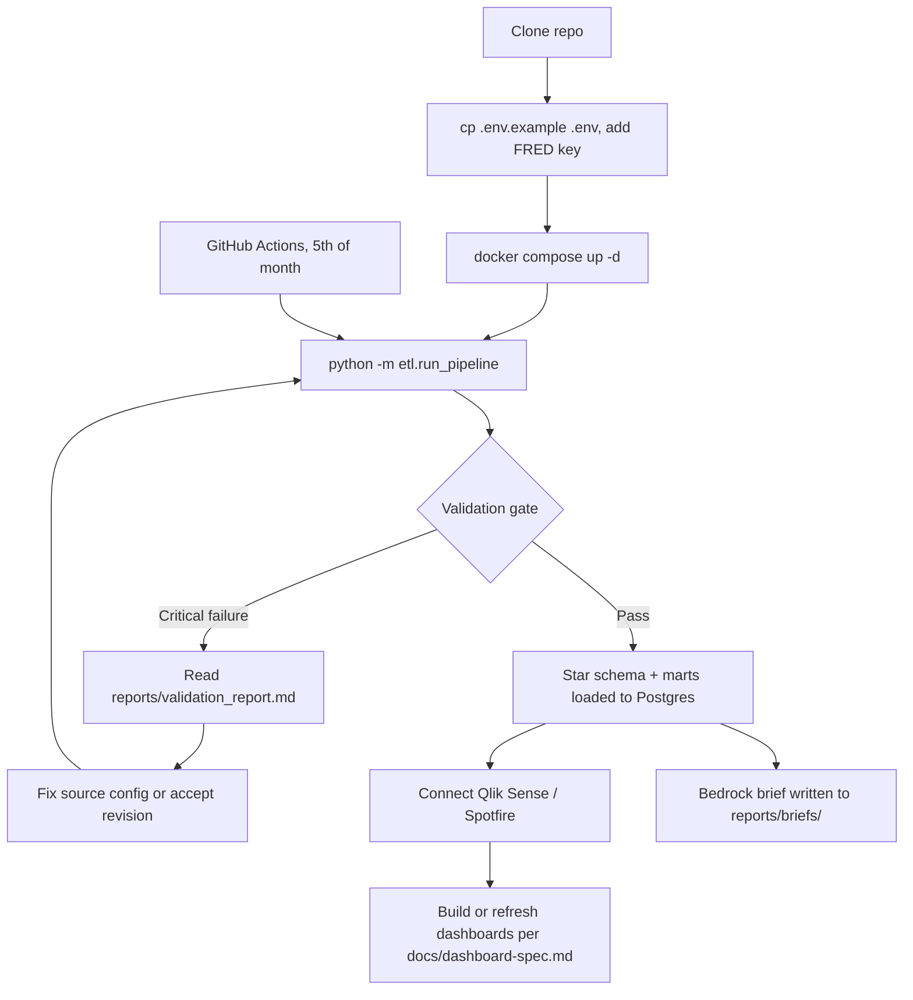

# User Flow

Two ways I actually use this: the monthly read (open the dashboard, see what moved) and the maintenance loop (run the pipeline, fix what broke). GitHub renders the diagrams below natively.

## Monthly read

## Maintenance loop

