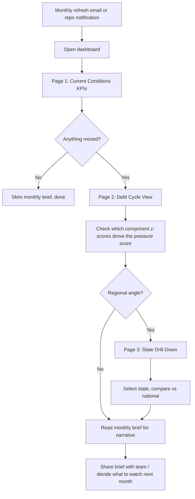
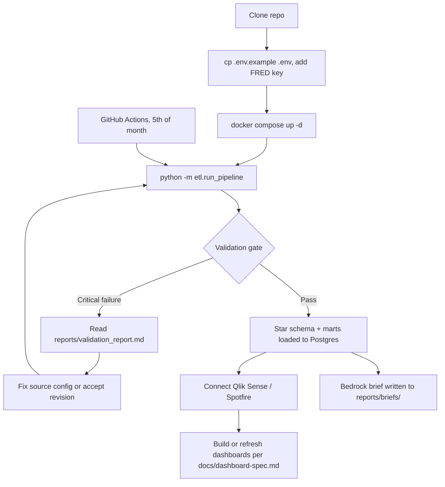

# User Flow

Two user types interact with the project: the **executive** (consumes dashboards and the monthly brief) and the **analyst/maintainer** (runs and extends the pipeline). GitHub renders the charts below natively.

## Executive flow

## Analyst / maintainer flow

