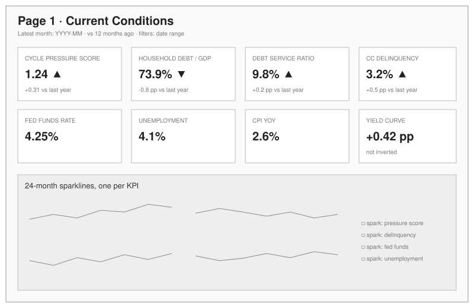
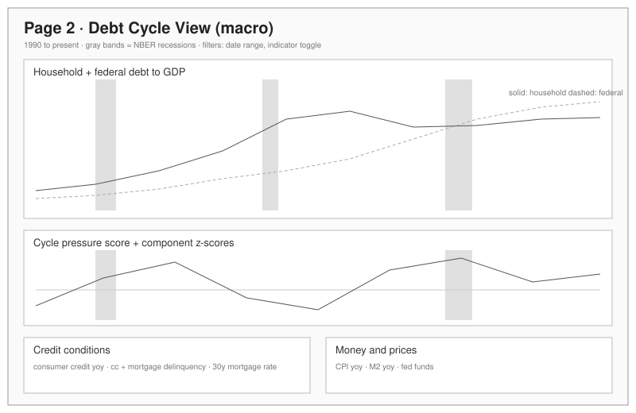
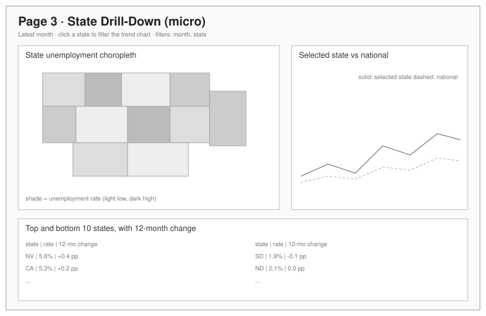

# Wireframes

Digital wireframes for the three dashboard pages, drawn before any dashboard work so both BI tools implement the same layout. The detailed content of each page is specified in [../dashboard-spec.md](../dashboard-spec.md); final screenshots from both tools go in [../screenshots/](../screenshots).

## Page 1: Current Conditions

## Page 2: Debt Cycle View (macro)

## Page 3: State Drill-Down (micro)

